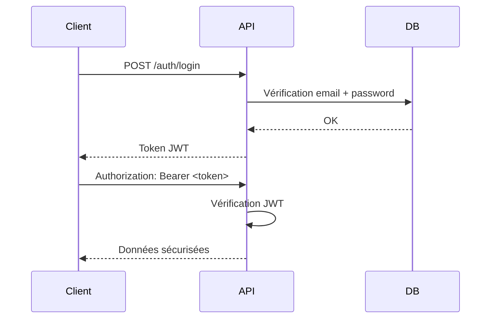

# 🛡️ API Secure – Spring Boot / JWT / Docker / MySQL / Swagger
API REST sécurisée avec **Spring Boot**, authentification **JWT**, base de données **MySQL via Docker**, migrations **Liquibase**, et documentation **Swagger UI**.  
Ce projet suit une architecture modulaire orientée **Feature-Based + couche Common/Security** pour favoriser la **scalabilité** et la **maintenabilité**.

---

## 📌 Table des matières
- [⚙️ Technologies utilisées](#️-technologies-utilisées)
- [📁 Structure du projet](#-structure-du-projet)
- [🚀 Installation du projet](#-installation-du-projet)
- [🐬 Configuration MySQL avec Docker](#-configuration-mysql-avec-docker)
- [⚙️ Configuration Spring Boot](#️-configuration-spring-boot)
- [🧬 Migrations avec Liquibase](#-migrations-avec-liquibase)
- [🧪 Tester l’API (Swagger / Postman)](#-tester-lapi-swagger--postman)
- [🔐 Authentification JWT – Flow](#-authentification-jwt--flow)
- [🚀 Prochaines améliorations possibles](#-prochaines-améliorations-possibles)
- [👨‍💻 Auteur](#-auteur)

---

## ⚙️ Technologies utilisées
| Catégorie | Technologies |
|-----------|--------------|
| Langage | Java 17 |
| Framework Backend | Spring Boot 3.5.x |
| Authentification | Spring Security + JWT |
| ORM | Hibernate / Spring Data JPA |
| DB | MySQL (via Docker) |
| Migration | Liquibase |
| Doc API | Swagger / springdoc-openapi |
| Build Tool | Maven |
| IDE | IntelliJ IDEA Community Edition |

---

## 📁 Structure du projet
```bash
src/main/java/com/eclubmaven/api_secure
│
├── ApiSecureApplication.java     # Point d’entrée Spring Boot
│
├── config/                       # Config globale (Spring/Security/Swagger)
├── common/                       # Utils, exceptions, constantes
├── security/                     # JWT + Filters + UserDetailsService
│
├── models/                       # Entities JPA (UserEntity, BaseEntity…)
│
└── modules/                      # Organisation par FEATURE
    └── auth/                    # AuthController, AuthService, DTO, Mapper…
```

## 🚀 Installation du projet
### 1. Générer le projet sur **https://start.spring.io**
| Option | Valeur recommandée |
|--------|--------------------|
| Project | Maven |
| Java | 17 |
| Packaging | JAR |
| Spring Boot | 3.5.x |
| Dependencies | Web, Security, JPA, MySQL, Lombok, Liquibase |
📥 **Télécharger le fichier ZIP**  
📂 **Extraire et ouvrir avec IntelliJ IDEA Community Edition**

---

## 🐬 Configuration MySQL avec Docker
### 📌 1. Créer un fichier `.env` dans `/docker-db`
```env
MYSQL_ROOT_PASSWORD=ToUpDaTePaSsWoRd
MYSQL_DATABASE=ApIsEcUrEdB
```

### 📌 2. Créer le script SQL d’utilisateur
📂 **docker-db/docker/mysql-init/script.sql**
```sql
CREATE USER IF NOT EXISTS 'ToUpDaTeUsErR'@'%' IDENTIFIED BY 'ToUpDaTePaSsWoRd';
GRANT SELECT, INSERT, UPDATE, DELETE, CREATE, ALTER, DROP, INDEX
  ON ApIsEcUrEdB.* TO 'ToUpDaTeUsErR'@'%';
FLUSH PRIVILEGES;
```

### 📌 3. Lancer MySQL
📂 **docker-db/docker/mysql-init/script.sql**
```bash
docker compose up
```

### 📌 4. Accéder à PhpMyAdmin
👉 http://localhost:8080

| Login   | Password |
|---------|----------|
| ToUpDaTeUsErR | ToUpDaTePaSsWoRd |
💡 **La base est créée mais vide – prête à recevoir les tables.**

---

## ⚙️ Configuration Spring Boot
📂 **src/main/resources/application.properties**
```properties
spring.application.name=api-secure

# MYSQL
spring.datasource.url=jdbc:mysql://127.0.0.1:3306/ApIsEcUrEdB?allowPublicKeyRetrieval=true&useSSL=false&serverTimezone=UTC
spring.datasource.username=ToUpDaTeUsErR
spring.datasource.password=ToUpDaTePaSsWoRd
spring.datasource.driver-class-name=com.mysql.cj.jdbc.Driver

# HIBERNATE
spring.jpa.hibernate.ddl-auto=create
spring.jpa.show-sql=true

# LIQUIBASE
spring.liquibase.enabled=false
spring.liquibase.change-log=classpath:db/changelog/db.changelog-master.yaml
```

---

## 🧬 Migrations avec Liquibase
👉 **Processus recommandé :**

| Étape | Objectif         |
|-------|------------------|
| 1     | Hibernate crée les tables automatiquement |
| 2     | Liquibase génère un fichier YAML basé sur les tables |
| 3     | Liquibase devient le gestionnaire de migration |
| 4     | À chaque run → migration auto |

---

## 📌 1️⃣ Supprimer l’ancien fichier Liquibase
```css
src/main/resources/db/changelog/db.changelog-master.yaml
```
## 📌 2️⃣ Vérifier la config Hibernate
```properties
spring.jpa.hibernate.ddl-auto=create
spring.liquibase.enabled=false
```
## 📌 3️⃣ Lancer l’application
**➡ Hibernate crée les tables automatiquement**
## 📌 4️⃣ Générer le fichier Liquibase
```bash
mvn liquibase:generateChangeLog
```
## 📌 5️⃣ Activer Liquibase
```properties
spring.jpa.hibernate.ddl-auto=validate
spring.liquibase.enabled=true
```
## 📌 6️⃣ Relancer l’application
**➡ Liquibase applique désormais les migrations automatiquement**

---

## 🧪 Tester l’API (Swagger / Postman)
### 📌 URL Swagger
```bash
http://localhost:8080/swagger-ui/index.html
```

### 📌 Flow d’authentification JWT

Étape	Route	Description
1	POST /auth/register	Créer un utilisateur
2	POST /auth/login	Retourne un JWT
3	Swagger → Authorize	Mettre Bearer <token>
4	GET /auth/me	Récupère l’utilisateur connecté
5	POST /logout	Token toujours valide (JWT stateless)

| Étape | Route               | Description        |
|-------|---------------------|--------------------|
| 1     | POST /auth/register | Créer un utilisateur |
| 2     | POST /auth/login    | Retourne un JWT |
| 3     | Swagger → Authorize | Mettre Bearer <token> |
| 4     | GET /auth/me | Récupère l’utilisateur connecté |
| 5     | POST /logout | Token toujours valide (JWT stateless) |

---

### 🔐 Authentification JWT (diagramme)



### 🚀 Prochaines améliorations possibles

- **✔ TokenBlacklistService (invalidation de JWT)**
- **✔ Module /users + /roles**
- **✔ Tests unitaires (JUnit + Mockito)**
- **✔ Docker Compose API + DB (prod/dev)**
- **✔ Déploiement Render.com / Railway / VPS**
- **✔ CI/CD GitHub Actions**

### 👨‍💻 Auteur

Développé par osscoco